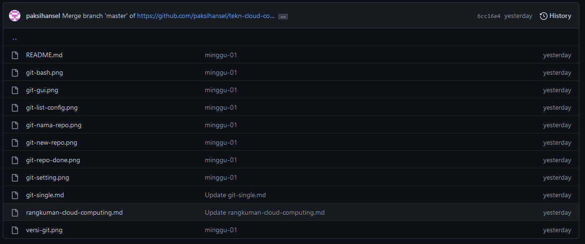
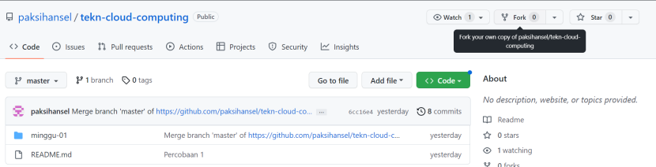
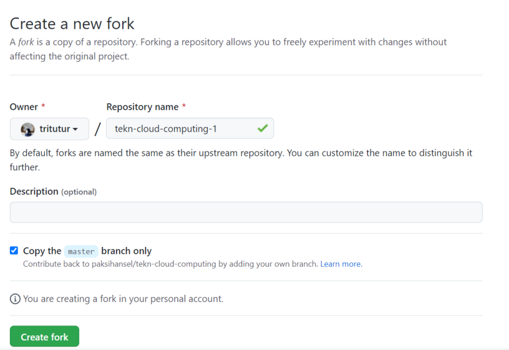
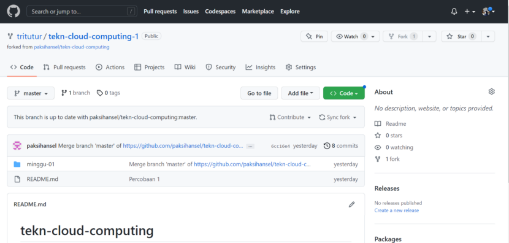
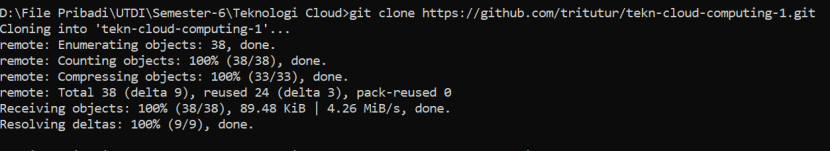
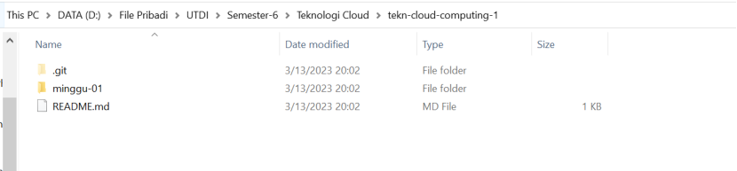

Fork
=====================

Proses forking ini dijelaskan dengan langkah-langkah berikut:

    1. Login ke GitHub
    2. Akses repo yang akan di-fork: https://github.com/paksihansel/tekn-cloud-computing
    

    
    3. Pada bagian atas git web kita klik Fork:
    

    4. Pilih akan ditempatkan di bagian mana.
    

    5. Setelah proses, repo dari upstream author sudah berada di account GitHub kontributor
    

    6. Kemudian coba lakukan clone pada repositori lokal di pc anda
    

