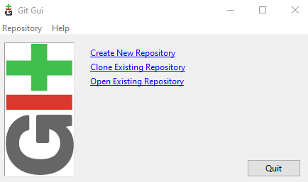
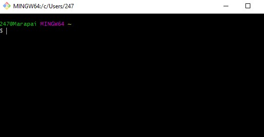
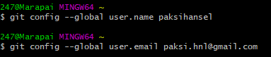
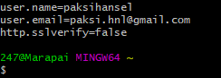
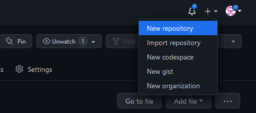
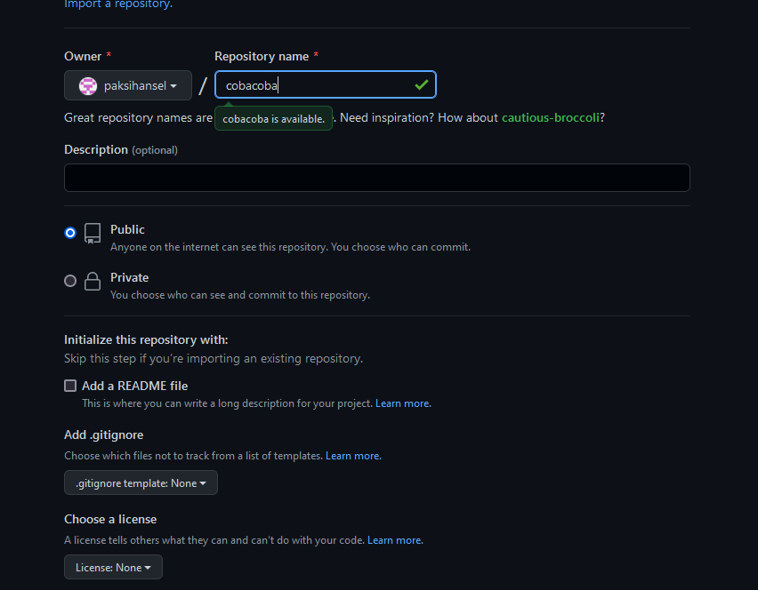
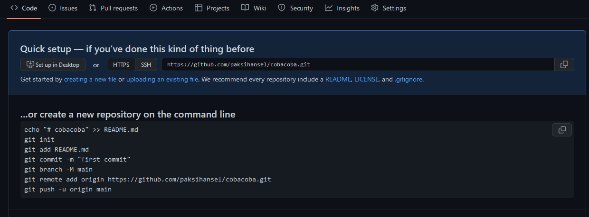

Materi RTFM Nomor 1-3
=====================

1. Install Git
--------------
di laptop saya sudah tersedia git 

2. Konfigurasi Git
-----------------
melakukan setting pada git username dan email

3. Mengelola Repository sendiri
------------------
Pembuatan repository sendiri

