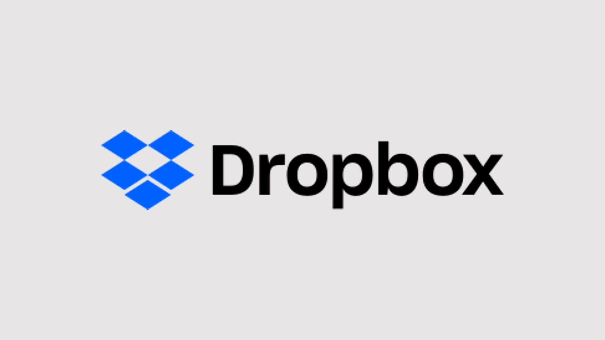
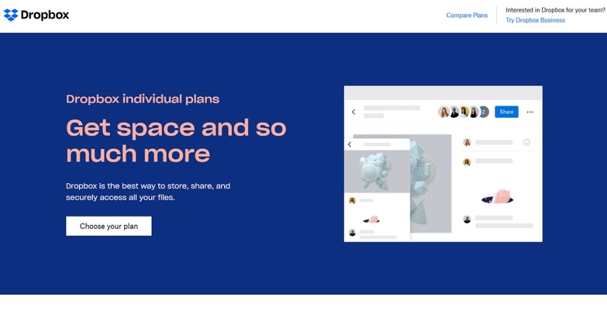
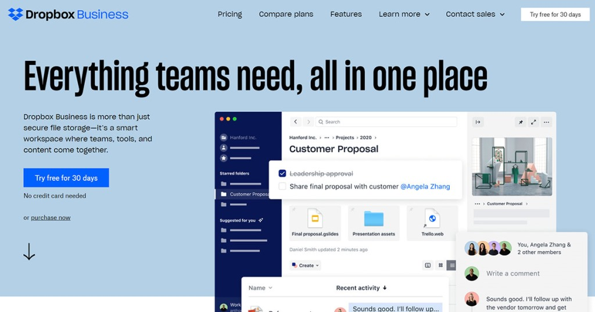
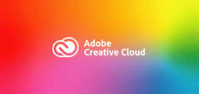
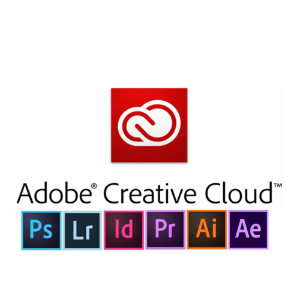

Dari latihan no 2, buat overview masing-masing layanan tersebut dan simpan dalam file layanan-saas.md, jangan lupa sertakan juga software non-cloud yang mempunyai fungsionalitas sama.
--------------------------------------------------------------------------------------------------------

# **1.Dropbox**

Dropbox adalah penyedia data berbasis web yang dioperasikan oleh Dropbox.inc

Dropbox menggunakan sistem penyimpanan berjaringan yang memungkinkan pengguna untuk menyimpan dan berbagi data serta berkas dengan pengguna lain di internet menggunakan sinkronisasi data

Pada tahun 2011 silam Dropbox meluncurkan Dropbox For Teams yang merupakan sebuah layanan dari Dropbox yang ditargetkan dan dikhususkan untuk mereka yang berada di kelompok bisnis atau dalam kelompok besar yang membutuhkan layanan untuk mengendalikan administrasi, tagihan yang terpusat dan keperluan lain yang cukup detail serta kompleks. Dropbox For Teams ini tersedia di laman web Dropbox dengan harga yang berbeda dari paket Dropbox lainnya.

## **Keunggulan Dropbox**

Bila dibandingkan dengan layanan serupa lainnya dan para pesaingnya, Dropbox berani menawarkan fitur dan akses yang relatif besar serta banyak dengan penggunaan sistem operasi yang tidak ditentukan dan bervariasi baik bagi pengguna mobile maupun pengguna desktop atau laptop. Dropbox juga menyediakan berbagai versi untuk beragam sistem operasi yang ada termasuk pengguna Microsoft Windows, Mac OS X, dan juga Linux.

## **Jenis dan Paket Dropbox**

1.Dropbox Individual

Layanan jenis ini lebih sering dipakai bagi pengguna individu yang terbagi dalam dua paket tersendiri yaitu Dropbox Plus dengan harga mulai 9,99 Dollar per bulan yang mempunyai storage sebesar 2 TB dan Dropbox Professional dengan harga 16,59 Dollar per bulan yang memberikan penggunanya storage sebanyak 3 TB

2.Dropbox Business

Paket jenis ini akan lebih sesuai bagi Anda yang mempunyai usaha atau perusahaan dengan jumlah pekerja yang banyak yang mengharuskan Anda menyimpan file dalam jumlah besar terus menerus. Paket ini dibagi tiga, yaitu Standard seharga 12,50 Dollar per bulan dan penyimpanan 5 TB, Advance dengan harga  20 dollar dan Enterprise dengan harga yang bisa dirundingkan. Kedua paket terakhir tadi menawarkan storage penyimpanan mengikut kemauan penggunanya.

----------------------------------
# **Adobe Creative Cloud**

adalah platform yang menyediakan semua programnya di satu tempat yang dapat dibayar dengan berlangganan, baik untuk seluruh program maupun program yang spesifik. 

## **Manfaat Menggunakan Adobe Creative Cloud**

Bagi desainer grafis dan pekerja di industri kreatif lainnya, Adobe Creative Cloud merupakan solusi terbaik yang mengerti kebutuhan penggunanya. Pilih software yang sesuai kebutuhan sehingga kamu terhindar dari kesulitan menggunakan software bajakan atau versi trial yang harus berakhir masa percobaannya setelah sebulan atau bahkan seminggu. 

