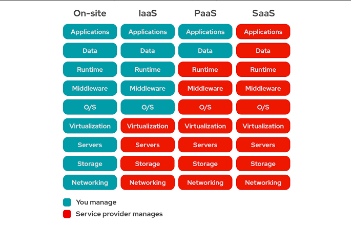
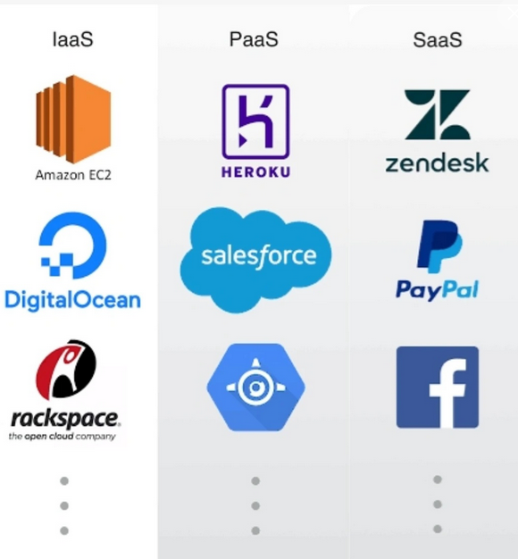
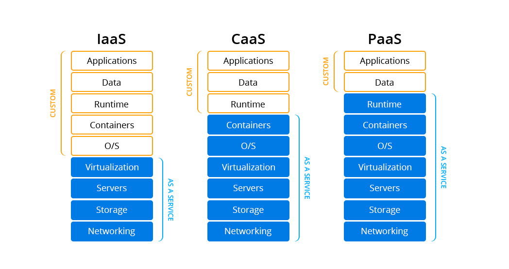
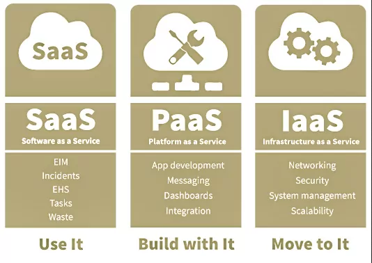

Rangkuman  SASS
------------------------

## **What is the difference between IaaS, SaaS, and Paas?**
----------------------------------------------------------------
-In IaaS, you select the pre-canned OS layer, deploy the application stack, deploy your code & then add your data

-In PaaS, you deploy your code (OS/Application Stack is part of the offering) & then add your data

-In SaaS, you add your data (everything else part of the offering

the picture of different beetwen them:

The picture example program

Service running in layer:

## **SAAS (Software as a Service) Platform Architecture**
------------------------------------------------------------
# **SAAS Architecture:**

With this model, a single version of the application, with a single configuration is used for all customers. The application is installed on multiple machines to support scalability (called horizontal scaling). In some cases, a second version of the application is set up to offer a select group of customers with access to pre-release versions of the applications for testing purposes.

There are two main varieties of SaaS:

1.Vertical SaaS A Software which answers the needs of a specific industry (e.g., software for the healthcare, agriculture, real estate, finance industries)

2.Horizontal SaaS The products which focus on a software category (marketing, sales, developer tools, HR) but are industry agnostic.    

# **Benefit of SAAS**

It offers substantial opportunities for organizations of all sizes to shift the risks of software acquisition, and to move IT from a reactive cost center to being a proactive, value-producing part of the enterprise. Traditionally, deploying large-scale software systems has been a major undertaking. Deploying these systems across a large enterprise costs more. 

## **What is Software as a Service SaaS Architecture**
---------------------------------------------------------

SaaS is a way to deliver software, the provider of the software centrally hosts one or more applications and makes them available to customers over the internet. SaaS architecture is also one of the main pillars of cloud computing.

# **Why Use SaaS Architecture?**

1.Consumers
2.Netflix
3.Microsoft Office 365
4.Amazon Prime
5.Twitter
6.Facebook