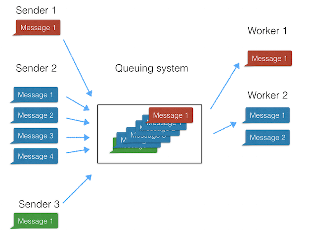

Rangkuman  SASS
------------------------

# **What is the difference between IaaS, SaaS, and Paas?**
----------------------------------------------------------------
-In IaaS, you select the pre-canned OS layer, deploy the application stack, deploy your code & then add your data

-In PaaS, you deploy your code (OS/Application Stack is part of the offering) & then add your data

-In SaaS, you add your data (everything else part of the offering

the picture of different beetwen them:

The picture example program

Service running in layer:

# **SAAS (Software as a Service) Platform Architecture**
------------------------------------------------------------
## **SAAS Architecture:**

With this model, a single version of the application, with a single configuration is used for all customers. The application is installed on multiple machines to support scalability (called horizontal scaling). In some cases, a second version of the application is set up to offer a select group of customers with access to pre-release versions of the applications for testing purposes.

There are two main varieties of SaaS:

1.Vertical SaaS A Software which answers the needs of a specific industry (e.g., software for the healthcare, agriculture, real estate, finance industries)

2.Horizontal SaaS The products which focus on a software category (marketing, sales, developer tools, HR) but are industry agnostic.    

## **Benefit of SAAS**

It offers substantial opportunities for organizations of all sizes to shift the risks of software acquisition, and to move IT from a reactive cost center to being a proactive, value-producing part of the enterprise. Traditionally, deploying large-scale software systems has been a major undertaking. Deploying these systems across a large enterprise costs more. 

# **What is Software as a Service SaaS Architecture**
---------------------------------------------------------

SaaS is a way to deliver software, the provider of the software centrally hosts one or more applications and makes them available to customers over the internet. SaaS architecture is also one of the main pillars of cloud computing.

## **Why Use SaaS Architecture?**

>Consumers

1.Netflix

2.Microsoft Office 365

3.Amazon Prime

4.Twitter

5.Facebook

>Business
Some of the other benefits of implementing SaaS architecture in the business include, but are not limited to:

1.Reduced time to market

2.Lower maintenance costs

3.Increased automation

## **Key Features and Benefits of a SaaS Architecture Platform**

1.The simplicity of SaaS Architecture Apps

Software applications architected as SaaS solutions are typically accessed over the web through various types of devices.

2.Economical Value

The monthly or annual subscript fee payment model makes it easier for businesses to budget, couple this with zero infrastructure setup costs, and it’s easy to see how opting to use SaaS solutions can save the business money.

3.Security

Security is an important aspect of software development solutions and SaaS platforms are no different.

4.Compatibility

With traditional software installations, updates and patches can occasionally require enormous amounts of time and money. This is especially true in the enterprise.

## **Disadvantages of a SaaS Platform**

# **How to build a cloud-based SaaS application**
-----------------------------------------------------

## How to get started on your SaaS application?

Which programming language, which database, which software tools should you choose? There are many questions which need to be answered. Therefore I’m trying to focus on the most important things.

The perfect database for your SaaS application

So, one of the first things on your list will include the installation of a database. We recommend making use of a document-oriented database. Document databases are quite different to the traditional concept of relational databases.

Queuing system for your SaaS application

Let’s talk about a queuing system now.

A message queuing system is an asynchronous communication protocol, enabling sender and receiver of a message not interacting at the same time.
Also known as Message Queuing (MSMQ) technology it enables web apps to run at different times and to communicate with various 3rd party integrations / APIs / and other services asynchronously.

AWS & EC2

Building a scalable web app you’ll probably end up at using Amazon Web Services sooner or later.

Why EC2?

The Amazon EC2 is a must-have for and the heart of our system which provides resizable computing capacity. We basically have rented virtual servers on which our web app runs.
The great thing here is, that those EC2 servers are spread across the world. Depending on your need to scale and which geographic markets to target first, you can select between various locations of your EC2.

Web Storage S3

Getting more and more users on board for your product will make you easily wonder about your web storage. With the Amazon S3 storage service, we have a great, and highly scalable object storage installed.

Content Delivery Network for your SaaS application

A content delivery network (CDN) is basically a system of distributed servers which enables you to serve content to your app users with high performance and high availability.
Let’s assume you have 3 EC2s installed. One in the US, one in Europe and one in Singapore. If someone from New York visits your app, the CDN enables you to serve content to the user through the EC2 located in the US.

