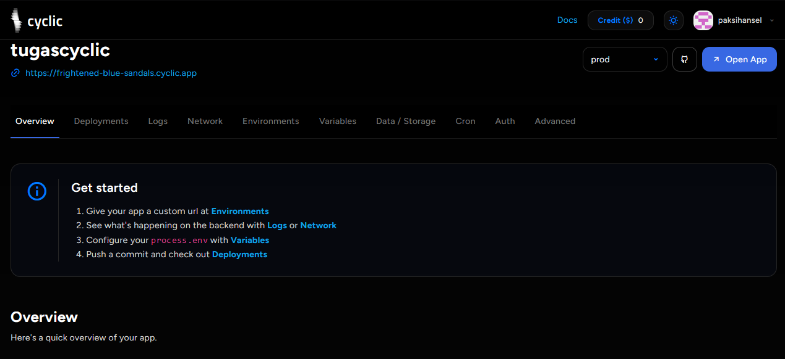

Deploy Some Code - DIY
--------------------------

You can always link your own repository from github.

>Sign up: https://app.cyclic.sh/api/login

>Using github as your login

>Choose "Link my own", and type in your repo name

>Approve "Cyclic - Preview" app in github

>Watch the terminal for your deployment logs

