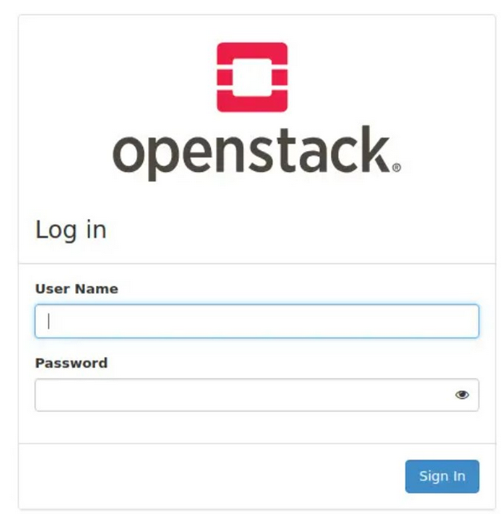

Install DevStack
-------------------

>Update Ubuntu

>Aktifkan sudo privileges untuk user ini tanpa memerlukan password.

>Clone Destack code dari Github.

>Membuat file local.conf dan isikan dengan passwords and IP Host

tambahkan

>Proses ini akan memakan waktu kira-kira 15-20 menit

>Access OpenStack Dashboard

