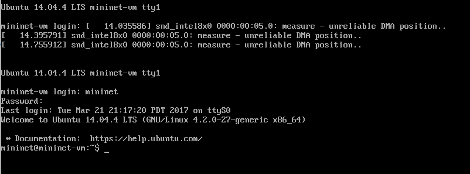

### OPENFLOW

## Installing required Software

>Untuk melakukan installasi Virtual Machine Image dapat didownload pada : 
https://github.com/mininet/mininet/releases/download/2.2.2/mininet-2.2.2-170321-ubuntu-14.04.4-server-amd64.zip 

# Virtual Machine 

## Import Virtual Machine 
>Setelah Anda mengunduh gambar .ovf, Jalankan VirtualBox, lalu pilih
File->Import Appliance dan pilih image .ovf yang telah diunduh.

>Selanjutnya, setelah klik import, lakukan setting pada network adapter 2 dengan memilih host-only adapter, seperti berikut :

>Kemudian jalankan virtualbox image dan login menggunakan username dan password **mininet**

## Setting up a Host-Only Network adapter 
>Setting interface dengan perintah : sudo dhclient eth1

## Setting up Port Forwarding 
>Untuk menyiapkan Port Forwarding menggunakan GUI, pilih VM dan buka
**Settings > Network > Adapter 1 > Advance > Port Forwarding** 
dan kemudian tambahkan aturan untuk meneruskan port host TCP 2222 ke port guest 22, sebagai berikut :

## SSH Connections after set up Port Forwarding 
>Pada windows jalankan perintah putty.exe -X -P 2222 -l <user name> localhost Dari perintah diatas, pop up windows akan muncul jika berhasil 

