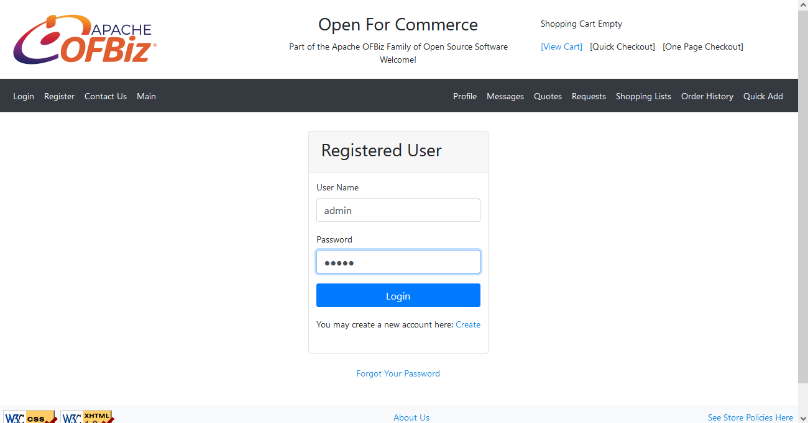
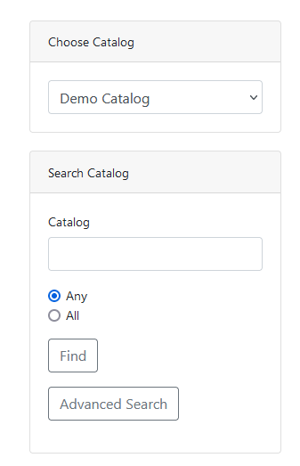
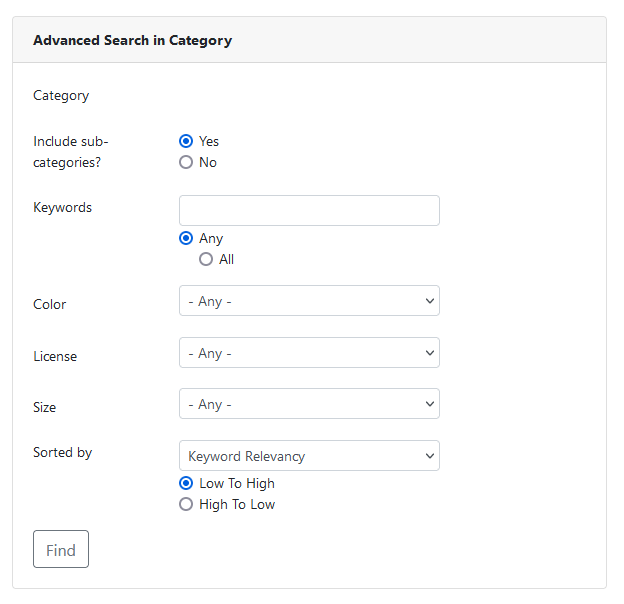
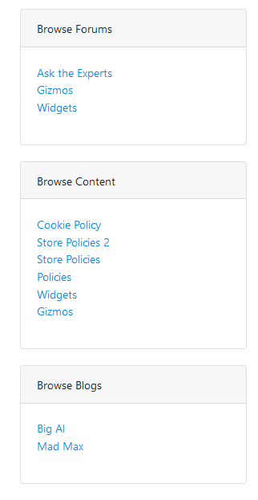

panduan penggunaan filter di Webstore E-Commerce
---------------------

>Login dahulu pada menu login

>lihat pada sisi kanan ada beberapa pilihan kotak

pada filter ini berfungsi untuk melakukan seleksi barang dengan cara memilih catalognya, atau bisa dibilang search by catalog. 

di sini juga bisa melakukan pencarian katalog secara advanced dengan memilih warna, category, ukuran, dll

lalu pada bagian ini adalah filter yang di sediakan oleh pihak ecommerce sendiri, dimana kategori pencariannya sudah di tentukan , ada juga pencarian atau filter barang mana saja yang pernah kita telusuri sebelumnya

