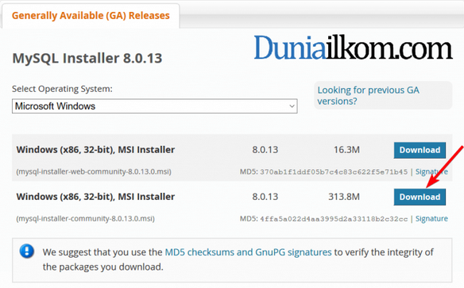
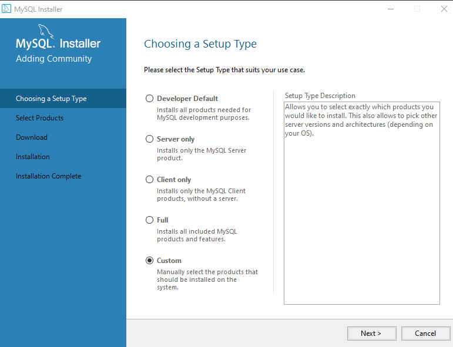
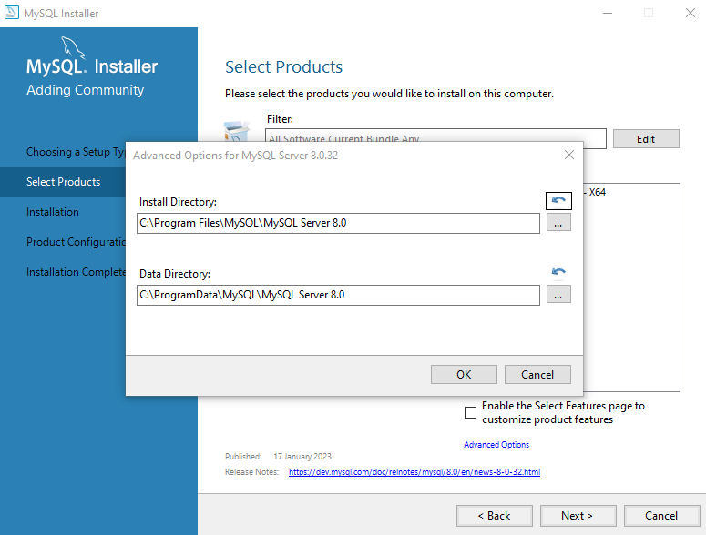
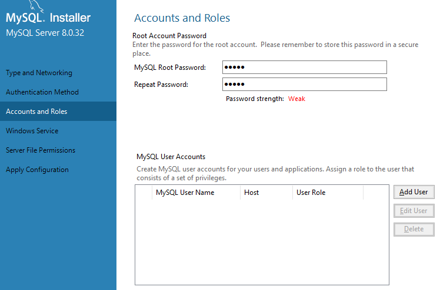
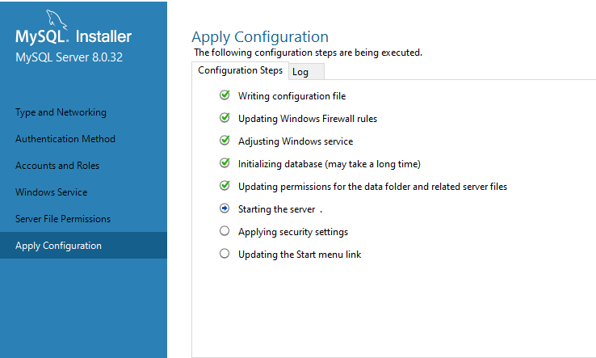

Install Mysql
--------------------

>pilih versi download mysql

>pilih mode custom

>pilih advanced option untuk memilih path penyimpanan

>settingan seperti berikut

>setting password user

>tunggu proses install hingga selesai

