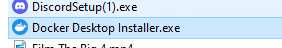
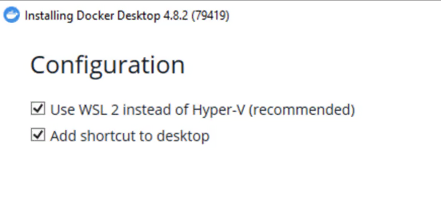

#Installasi Docker pada Windows
-----------------------------------

1.Download docker pada web yang tersedia

2.Mulai installasi docker

3.Konfigurasi Docker menggunakan WSL 2

4.Proses Intallasi docker

5.Accept term dockers

6.intall WSL 2

7.Download WSL2 kernel

8.Setelah selesai installasi tunggu hingga selesai lalu restart pc

