### Step 1: Define the application dependencies
1. Create a directory for the project:
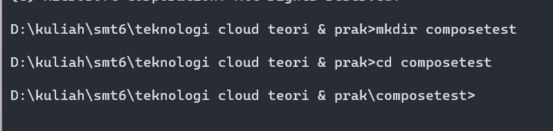
2. Create a file called app.py in your project directory and paste the following code in:
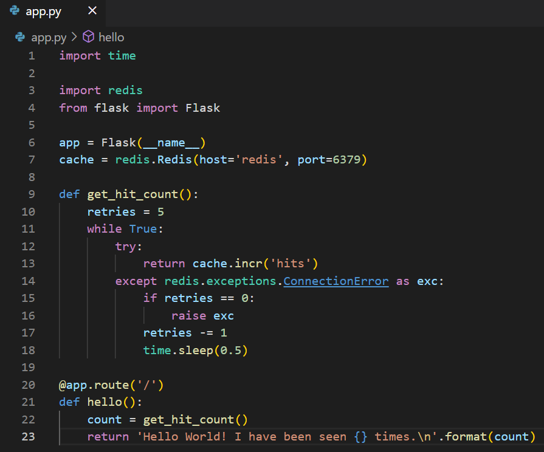
3. Create another file called requirements.txt in your project directory and paste the following code in:
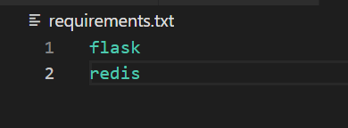

### Step 2: Create a Dockerfile
1. In your project directory, create a file named Dockerfile and paste the following code in:
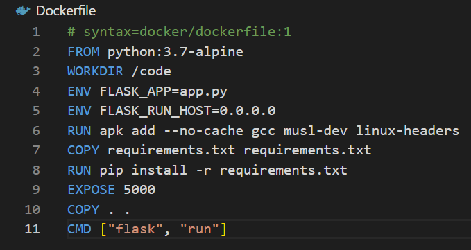

### Step 3: Define services in a Compose file
1. Create a file called docker-compose.yml in your project directory and paste the following:
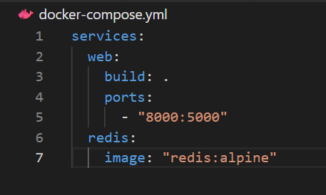

### Step 4: Build and run your app with Compose
1. From your project directory, start up your application by running docker compose up.
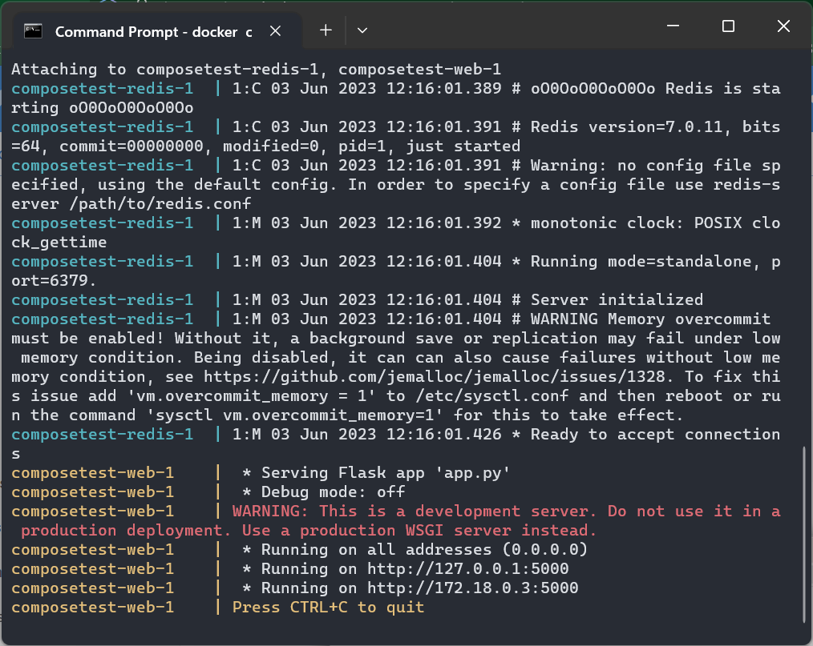
2. Enter http://localhost:8000/ in a browser to see the application running.
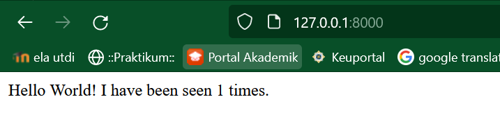
3. Refresh the page. The number should increment.
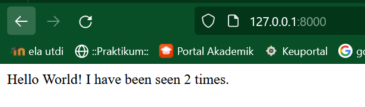
4. Switch to another terminal window, and type docker image ls to list local images.
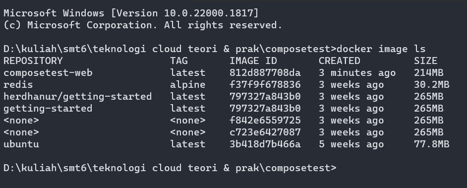
5. Stop the application, either by running docker compose down from within your project directory in the second terminal, or by hitting CTRL+C in the original terminal where you started the app.

### Step 5: Edit the Compose file to add a bind mount
1. Edit docker-compose.yml in your project directory to add a bind mount for the web service:
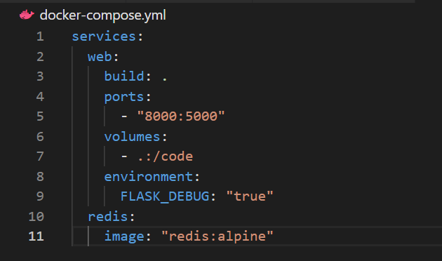

### Step 6: Re-build and run the app with Compose
1. From your project directory, type docker compose up to build the app with the updated Compose file, and run it. Check the Hello World message in a web browser again, and refresh to see the count increment.
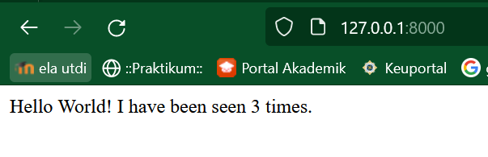

### Step 7: Update the application
1. Change the greeting in app.py and save it. For example, change the Hello World! message to Hello from Docker!:
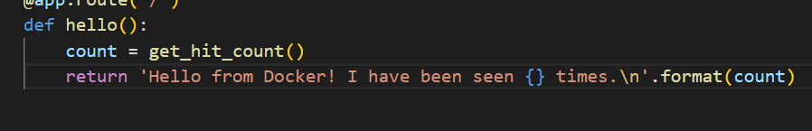
2. Refresh the app in your browser. The greeting should be updated, and the counter should still be incrementing.
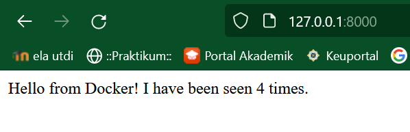

### Step 8: Experiment with some other commands
1. If you want to run your services in the background, you can pass the -d flag (for “detached” mode) to docker compose up and use docker compose ps to see what is currently running:
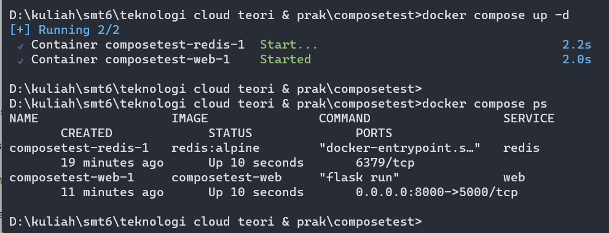
2. The docker compose run command allows you to run one-off commands for your services. For example, to see what environment variables are available to the web service:
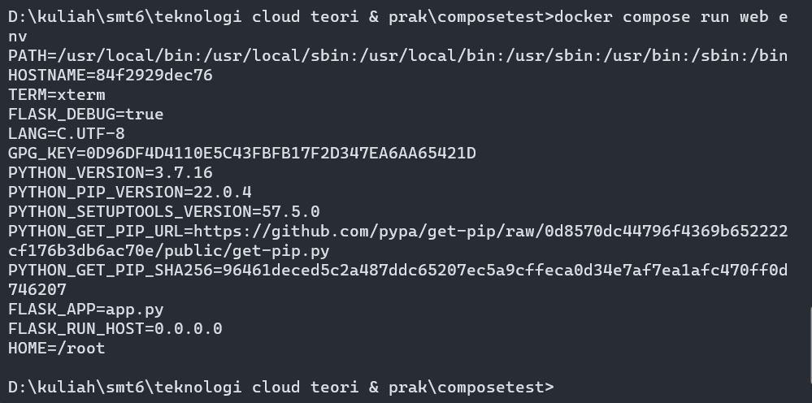
3. If you started Compose with docker compose up -d, stop your services once you’ve finished with them:
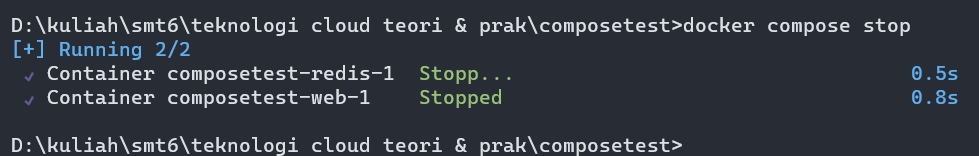
4. You can bring everything down, removing the containers entirely, with the down command. Pass --volumes to also remove the data volume used by the Redis container:
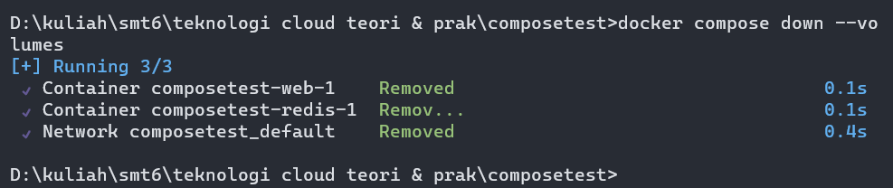