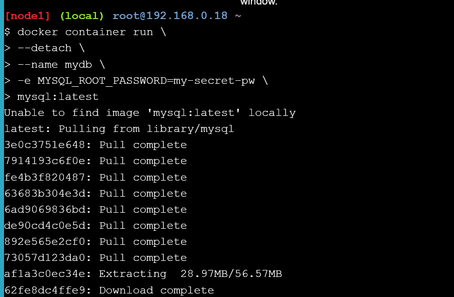
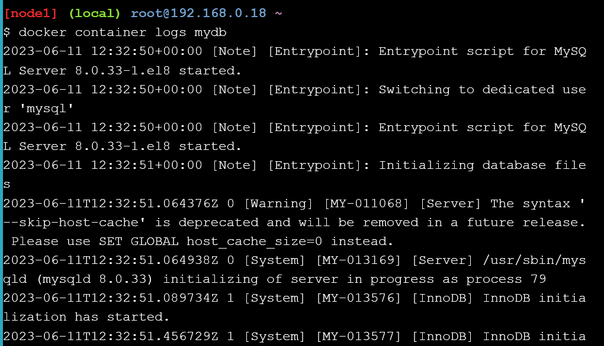
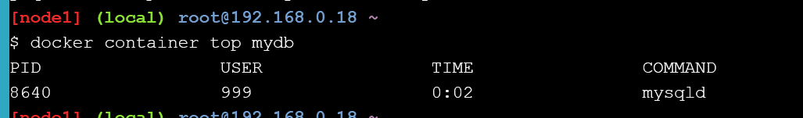
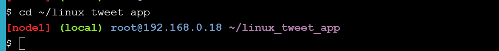
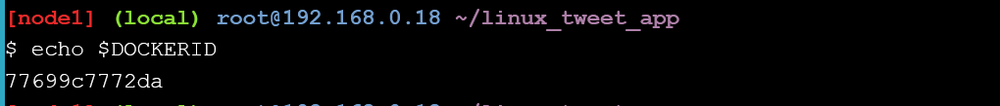
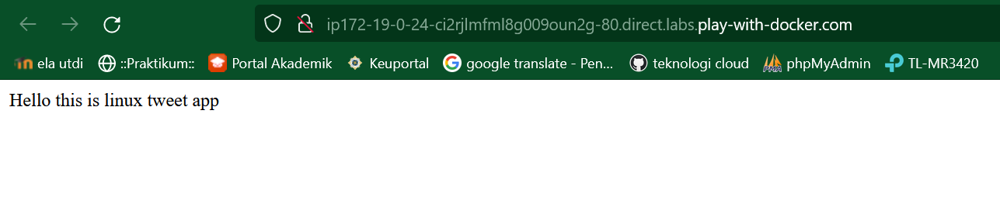
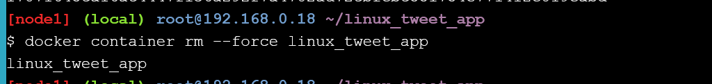
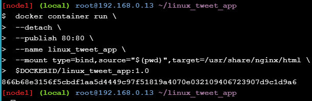
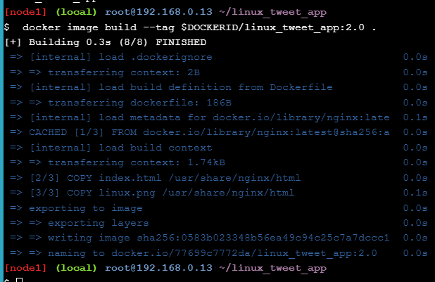
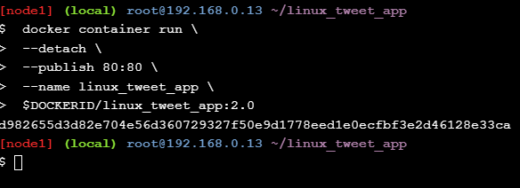

### Task 1: Run some simple Docker containers
#### Run a single task in an Alpine Linux container
1. Run the following command in your Linux console.

2. Docker keeps a container running as long as the process it started inside the container is still running. In this case the hostname process exits as soon as the output is written. This means the container stops. However, Docker doesn’t delete resources by default, so the container still exists in the Exited state.
List all containers.

#### Run an interactive Ubuntu container
1. Run a Docker container and access its shell.

2. Run the following commands in the container.

3. Type exit to leave the shell session. This will terminate the bash process, causing the container to exit.

4. For fun, let’s check the version of our host VM.

#### Run a background MySQL container
1. Run a new MySQL container with the following command.

2. List the running containers.

3. You can check what’s happening in your containers by using a couple of built-in Docker commands: docker container logs and docker container top.

Let’s look at the processes running inside the container.

4. List the MySQL version using docker container exec.

5. You can also use docker container exec to connect to a new shell process inside an already-running container. Executing the command below will give you an interactive shell (sh) inside your MySQL container.

6. Let’s check the version number by running the same command again, only this time from within the new shell session in the container.

7. Type exit to leave the interactive shell session.

### Task 2: Package and run a custom app using Docker
#### Build a simple website image
1. Make sure you’re in the linux_tweet_app directory.

2. Display the contents of the Dockerfile.

3. Echo the value of the variable back to the terminal to ensure it was stored correctly

4. Use the docker image build command to create a new Docker image using the instructions in the Dockerfile.

5. Use the docker container run command to start a new container from the image you created.

7. result

6. Once you’ve accessed your website, shut it down and remove it.

### Task 3: Modify a running website
1. Let’s start the web app and mount the current directory into the container.

2. Go to the running website and refresh the page. Notice that the site has changed.

3. Copy a new index.html into the container.

4. website

5. stop and rerun without bind

6. build new image

7. docker image ls

8. rerun new container

9. running 2 container

10. website

